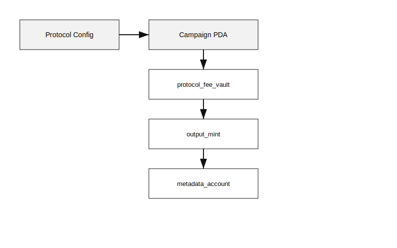

# REDAX Hub Account Map v1.1

> PDA hierarchy, account structures, and ownership boundaries. Byte and rent
> notes are approximate until audit.

### Treasury Terminology Update (SPEC v1.1, Section 13.3)

**Naming change:** The REDAX protocol fee vault was previously referred to as campaign treasury. The current term is `protocol_fee_vault`, which disambiguates REDAX's fee vault from the project's own off-protocol treasury.

**Conceptual map:**

| Concept | Owner | Purpose | In REDAX scope? |
| --- | --- | --- | --- |
| `protocol_fee_vault` (renamed) | Campaign PDA | Holds REDAX 1% output fee | YES |
| `project_treasury` | `output_governance` | Project's own output token treasury | NO (off-protocol, external) |
| `treasury_policy` | Locked at creation | Execution policy on `protocol_fee_vault` | YES |

### Campaign PDA - Output Governance Fields (added in SPEC v1.1, Section 13)

| Field | Type | Bytes | Mutability | Notes |
| --- | --- | --- | --- | --- |
| `merger_type` | u8 | 1 | Immutable post-create | Phase 1: only 0 (SingleProjectMigration) accepted |
| `output_mint_mode` | u8 | 1 | Immutable post-create | Phase 1: only 0 (ProgramCreatedOutputMint) accepted |
| `metadata_strategy` | u8 | 1 | Immutable post-create | Phase 1: only 0 (MetaplexMetadataCPI) accepted |
| `output_governance` | Pubkey | 32 | Immutable post-create | Economic owner of output token. Cannot equal protocol multisig. |
| `authority_policy` | u8 | 1 | Immutable post-create | 0=Revoked (default), 1=BoundToCampaign, 2=TransferToGovernance |
| `official_attestation_status` | u8 | 1 | Mutable (program-only, Phase 2) | 0=None, 1=PendingAttestations, 2=FullyAttested, 3=AttestationFailed |
| `required_attestations_count` | u8 | 1 | Set at create_campaign | Phase 1: always 0. Phase 2: computed from accepted legacy mints |
| `received_attestations_count` | u8 | 1 | Mutable (program-only, Phase 2) | Incremented on each `submit_legacy_attestation` |
| `disclaimer_hash` | [u8; 32] | 32 | Immutable post-create | Phase 2 only. Off-chain disclaimer document hash. |

**Total new bytes per Campaign:** 71 bytes (before alignment padding). **Rent
impact:** ~0.0005 SOL per campaign. Negligible.

### Output Mint Account Configuration (Phase 1)

For Phase 1 ProgramCreatedOutputMint campaigns, the output SPL Mint account is
created with the following exact configuration:

| Field | Phase 1 value | Phase 2 status |
| --- | --- | --- |
| `decimals` | 9 (locked per SPEC v1) | Same |
| `mint_authority` | Campaign PDA | Same |
| `freeze_authority` | **None (mandatory)** | Phase 2 may allow Campaign PDA opt-in |
| `supply` | 0 at creation, grows via convert | Same |
| Token program | SPL Token | Phase 2 may allow Token-2022 |

A separate Metaplex Token Metadata account is created via CPI in the same
transaction:

| Field | Phase 1 value |
| --- | --- |
| Mint reference | Output mint pubkey |
| Update authority | `output_governance` |
| `name` | Creator-declared, <= 32 bytes |
| `symbol` | Creator-declared, <= 10 bytes |
| `uri` | Creator-declared, <= 200 bytes (off-chain JSON pointer) |
| Owner program | Metaplex Token Metadata Program |

### LegacyProjectAttestation PDA (defined Phase 1, activated Phase 2)

**Purpose:** On-chain proof that a legacy project's owner has endorsed a
specific campaign.

**Phase 1 status:** PDA struct defined but `submit_legacy_attestation`
instruction is gated. Calling it returns `Phase2FeatureNotEnabled`.

**Phase 2 status:** Fully activated.

**PDA Seeds:**
`["legacy_attestation", campaign.key().as_ref(), legacy_mint.key().as_ref()]`

**Cardinality:** One PDA per `(campaign, legacy_mint)` pair.

| Field | Type | Bytes | Mutability | Notes |
| --- | --- | --- | --- | --- |
| `campaign` | Pubkey | 32 | Immutable | Parent campaign reference |
| `legacy_mint` | Pubkey | 32 | Immutable | The legacy mint being attested |
| `project_owner` | Pubkey | 32 | Immutable | Address that signed the attestation |
| `attestation_authority_source` | u8 | 1 | Immutable | 0-5, see SPEC §13.8 R-OG-6 table |
| `signed_at` | i64 | 8 | Immutable | Unix timestamp at signing |
| `revoked` | bool | 1 | Mutable (signer-only, pre-campaign-start) | Set true if attestation revoked |
| `evidence_hash` | [u8; 32] | 32 | Immutable | Hash of off-chain attestation document |
| `evidence_uri_hash` | [u8; 32] | 32 | Immutable | Hash of off-chain evidence URI |
| `verified_tier_reviewed` | bool | 1 | Mutable (multisig-only, Phase 2) | True if REDAX multisig has reviewed off-chain sources (3, 4, 5) |

**Total bytes per attestation:** 179 bytes (before discriminator and padding).
**Rent impact:** ~0.0014 SOL per attestation. Paid by `project_owner` at
submission.

### Account ownership matrix (extended)

| Account | Owner program | Mutable by | Notes |
| --- | --- | --- | --- |
| `Campaign` | REDAX program | Campaign PDA + `campaign_admin` (operational fields) + `output_governance` (post-finalize, future) | Three-tier mutability |
| `protocol_fee_vault` (renamed) | REDAX program | Campaign PDA only, per locked `treasury_policy` | output_governance has NO authority |
| Output Mint | SPL Token Program | Campaign PDA (mint operations within Total Output Cap) | Phase 1: freeze_authority None |
| Metaplex Metadata Account | Metaplex Token Metadata Program | `output_governance` (update authority) | Created via CPI at `create_campaign` |
| `LegacyProjectAttestation` (Phase 2) | REDAX program | `project_owner` + REDAX multisig (verified_tier_reviewed) | Otherwise immutable |
