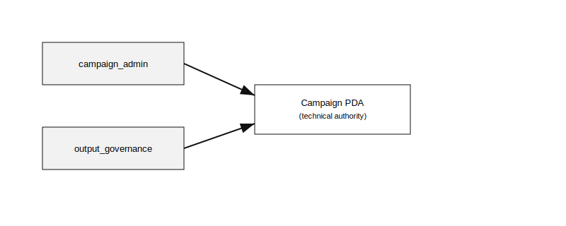
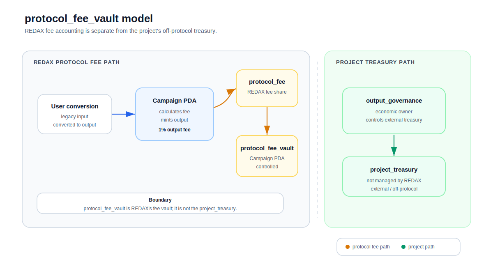
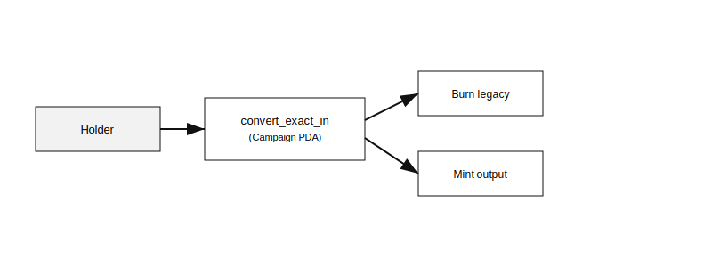

# REDAX Hub Protocol Specification v1.1

> Status: Specification freeze in progress. Scope: Phase 1 mainnet specification
> with Phase 2 placeholders. No production implementation code is published in
> this repository.

## Section 13: Output Governance & Multi-Project Merger Foundation

### 13.1 Background

Prior SPEC versions treated `campaign_admin` as the sole representative of all
roles relating to a campaign. This section separates four distinct roles,
introduces normative rules for multi-project mergers, clarifies treasury
terminology, defines output mint metadata policy, and specifies the UI's role as
a discovery layer.

### 13.1.1 Architecture Diagrams





### 13.2 Role Definitions

- **OPERATIONAL AUTHORITY** (`campaign_admin`): The address authorized to pause,
  unpause, finalize, and update operational parameters of a campaign.
- **TECHNICAL MINT AUTHORITY** (Campaign PDA): The program-derived address
  holding `mint_authority` of the output mint. Bounded by Total Output Cap and
  the convert flow logic. Cannot make economic or governance decisions.
- **ECONOMIC OWNERSHIP** (`output_governance`): The address that economically
  owns the output token. Makes post-campaign decisions over the output mint and
  the project's own treasury (off-protocol). Future steward of the output mint.
- **PROJECT CONSENT** (`LegacyProjectAttestation`): On-chain proof that a legacy
  project's owner has endorsed the campaign. Phase 2 only.

### 13.3 Treasury Terminology - Disambiguation

To eliminate prior ambiguity, REDAX SPEC v1.1+ uses three distinct treasury
concepts:

| Term                 | Owner                                | Purpose                                                                | On-chain location                                            |
| -------------------- | ------------------------------------ | ---------------------------------------------------------------------- | ------------------------------------------------------------ |
| `protocol_fee_vault` | REDAX program (Campaign PDA bounded) | Holds REDAX's 1% output token fee accumulated during the campaign      | PDA derived from Campaign + protocol fee seed                |
| `project_treasury`   | `output_governance` (off-protocol)   | The project's own treasury for the output token. NOT managed by REDAX. | Any address chosen by output_governance; outside REDAX scope |
| `treasury_policy`    | Locked at create_campaign            | Execution policy applied to `protocol_fee_vault` (Hold/Vest/LP/Mixed)  | Stored in Campaign PDA, immutable                            |

**Naming change (v1 to v1.1):** The REDAX protocol fee vault was previously referred to as campaign treasury. The current term is `protocol_fee_vault`, which makes it unambiguous: this vault holds REDAX's protocol fee, NOT the project's treasury.

The protocol fee vault is owned by the program (Campaign PDA bounded). The
campaign creator selects a `treasury_policy` at creation; REDAX cannot deviate
from it on-chain. The `output_governance` address has NO authority over
`protocol_fee_vault` - REDAX retains its protocol fee per locked policy.

### 13.4 Campaign Types

REDAX defines four campaign types via `merger_type: u8` on Campaign PDA. Phase 1
enforces that only `SingleProjectMigration` is accepted; other types are
rejected at program level.

| Value | Type                         | Phase 1 status          | Phase 2 status           |
| ----- | ---------------------------- | ----------------------- | ------------------------ |
| 0     | `SingleProjectMigration`     | **Accepted** (default)  | Accepted                 |
| 1     | `OfficialMultiProjectMerger` | **Rejected** by program | Accepted                 |
| 2     | `UnofficialMigrationOffer`   | **Rejected** by program | Accepted with disclaimer |
| 3     | `CommunityLedMigration`      | **Rejected** by program | Accepted with evidence   |

**Rationale for Phase 1 single-type:** Pre-launch reputation safety dominates. A
single misuse against a popular legacy mint would generate scam headlines that
destroy REDAX's audit and architecture investment. Phase 1 mainnet runs with
only `SingleProjectMigration` enabled. Other types ship in Phase 2 after the
protocol has established a track record.

### 13.5 Output Mint Modes & Authority Configuration

REDAX defines two output mint modes via `output_mint_mode: u8`. Phase 1 enforces
only `ProgramCreatedOutputMint`.

| Value | Mode                       | Phase 1 status          | Phase 2 status                         |
| ----- | -------------------------- | ----------------------- | -------------------------------------- |
| 0     | `ProgramCreatedOutputMint` | **Required**            | Accepted (default)                     |
| 1     | `ExistingOutputMint`       | **Rejected** by program | Accepted with mint authority migration |

**ProgramCreatedOutputMint behavior (Phase 1):**

- `create_campaign` atomically creates a new SPL Mint account.
- `mint_authority = Campaign PDA` (program-derived).
- **`freeze_authority = None` (mandatory in Phase 1).**
- `decimals = 9` (locked per SPEC v1).
- Output token program: SPL Token (Token-2022 output deferred to Phase 2).



**Phase 1 freeze authority rule:**

The output mint's `freeze_authority` MUST be `None` in Phase 1. The Campaign PDA
does NOT hold freeze authority. This is mandatory, not opt-in, for the following
reasons:

- Audit surface reduction: removes an entire class of "what can be frozen, by
  whom, when" questions.
- DEX compatibility: some DEX listing programs and aggregators discriminate
  against tokens with active freeze authorities.
- No identified Phase 1 use case: convert flow does not require freezing.
- Phase 2 evaluation: if a real use case emerges (e.g., compliance-driven
  freezing for institutional campaigns), `freeze_authority = Campaign PDA` may
  be added as opt-in with explicit justification.

**ExistingOutputMint behavior (Phase 2 only, NOT in Phase 1):**

- Campaign creator brings a pre-existing SPL Mint.
- Before campaign activation, mint authority MUST be transferred to Campaign
  PDA.
- Program checks that the supplied mint's `mint_authority == Campaign PDA` at
  the time of `add_legacy_token` and at every `convert_exact_in` call (not only
  at activation).
- Existing supply (if any) MUST be disclosed in UI to holders before convert.
- Phase 2 will define freeze authority handling for ExistingOutputMint
  separately.

**Rationale for Phase 1 single-mode:** ProgramCreatedOutputMint with
freeze_authority=None eliminates the entire class of mint authority transfer
attacks AND freeze authority misuse. Audit firms get a structurally simpler
scope. ExistingOutputMint is product-relevant for projects with existing token
metadata, but the security tradeoff is non-trivial; deferring to Phase 2 does
not block adoption.

### 13.6 Output Metadata Policy

SPL Mint accounts do NOT store name, symbol, or URI fields. Token metadata
(name, symbol, image, description) lives in a separate Metaplex Token Metadata
account or, for Token-2022, in a metadata extension. REDAX SPEC v1.1 defines how
output mint metadata is created and where it is stored.

**Phase 1 mandatory strategy:** `MetaplexMetadataCPI`

For SPL Token output mints created by REDAX in Phase 1:

- `create_campaign` instruction MUST include a CPI to the Metaplex Token
  Metadata Program (`mpl-token-metadata`).
- The CPI creates a Metadata PDA owned by Metaplex, derived from the output
  mint.
- Metadata fields: `name` (<= 32 chars), `symbol` (<= 10 chars), `uri` (<= 200
  chars; off-chain JSON pointer to image, description, attributes).
- Update authority on the metadata account: `output_governance` (so the project
  can update metadata post-campaign).
- The metadata account is created in the same transaction as the output mint and
  the Campaign PDA - fully atomic.

**Why Metaplex CPI in Phase 1:**

- Wallets (Phantom, Solflare, Backpack) recognize Metaplex metadata immediately.
  Output token displays correctly upon receipt.
- Standard pattern; audit firms know it well.
- Update authority on `output_governance` is the right separation: the project,
  not REDAX, controls metadata changes after creation.

**Rejected alternatives for Phase 1:**

- `NoOnChainMetadata` (only off-chain hash stored): Wallets show "Unknown
  Token" - bad UX for holders. Rejected.
- `Token2022MetadataExtension`: requires Token-2022 output mint; Phase 1 uses
  SPL Token only. Deferred to Phase 2.
- `CreatorDeclaredPostCampaign`: creator adds metadata after campaign -
  atomicity broken. Rejected.

**Field on Campaign PDA:** `metadata_strategy: u8`. Phase 1 valid values:

- 0 = `MetaplexMetadataCPI` (mandatory)

Phase 2 will add:

- 1 = `Token2022MetadataExtension` (when Token-2022 output supported)
- 2 = `CreatorDeclaredPostCampaign` (advanced, with explicit warning)

**Metadata input validation (Phase 1):**

- Program rejects `name` longer than 32 bytes.
- Program rejects `symbol` longer than 10 bytes.
- Program rejects `uri` longer than 200 bytes.
- Program does NOT validate `uri` content (off-chain JSON conformance is the
  creator's responsibility).
- The `uri` field's pre-image hash is emitted as event for off-chain monitoring.

### 13.7 UI as Discovery Layer (Phase 1 Discovery Policy)

Program-level restrictions alone (e.g., `merger_type` enforcement) do NOT
prevent unreviewed campaigns from existing on-chain. Anyone paying the 0.5 SOL
creation fee can create a permissionless `SingleProjectMigration` campaign.
Phase 1 reputation safety therefore requires UI-layer discovery controls.

**Canonical REDAX UI (redaxhub.com) Discovery Policy in Phase 1:**

The canonical REDAX UI MUST adhere to the following discovery rules during Phase
1 (until Verified Tier governance is fully active in Phase 2):

1. **Default discovery feed shows only REDAX-reviewed pilot campaigns.** During
   the Phase 1 pilot stage, all campaigns surfaced by default in the canonical
   UI MUST have undergone manual review by the REDAX team. This effectively
   makes Phase 1 a curated marketplace.

2. **Direct-link access is permitted but warned.** Users who navigate directly
   to a campaign address (via deep link or share URL) for an unreviewed campaign
   MUST be shown a prominent warning banner before any campaign details render:

   ```
   WARNING: THIS CAMPAIGN IS NOT REVIEWED BY REDAX

   This campaign exists on-chain but has not been reviewed by the REDAX team.
   It is not surfaced in the default discovery feed.

   Anyone can create a Campaign by paying 0.5 SOL. REDAX cannot prevent
   this. You should verify the campaign creator independently before
   converting any tokens.

   Proceed only if you fully understand the risks.

   [I understand - show campaign details]
   ```

3. **No search/listing without review status indicator.** Any UI surface that
   lists multiple campaigns (search results, browse pages, filters) MUST display
   a review-status badge for each campaign:
   - REDAX Reviewed (Phase 1 pilot)
   - Unreviewed (proceed with caution)

4. **Phase transition.** This Discovery Policy applies during Phase 1. In Phase
   2, the policy transitions to Verified Tier governance: campaigns that pass
   the 7-criteria Verified Tier review (per separate SPEC) display "Verified"
   badge; campaigns without Verified Tier still appear but with appropriate
   indicators.

**Third-party UIs:** Third-party REDAX-compatible UIs MAY adopt different
discovery policies, but to claim REDAX-compatible status (used in marketing or
in Verified Tier eligibility), they MUST adhere to the Discovery Policy in this
section during Phase 1.

**Rationale:** Pre-launch REDAX cannot rely on permissionless discovery as the
default user experience without enabling a single bad actor to destroy protocol
reputation. Curated discovery + warned direct-link access preserves the
permissionless on-chain layer (anyone can create) while protecting the default
holder experience.

### 13.8 Normative Rules

#### R-OG-1 - REDAX Protocol Ownership Boundary

The REDAX protocol multisig MUST NOT be set as `output_governance` for any
campaign. The REDAX protocol MUST NOT hold `mint_authority` for any output mint
created via the protocol. REDAX revenue is bounded to the protocol fee (1%
output) and creation fee (0.5 SOL); REDAX MUST NOT receive output tokens beyond
this fee.

#### R-OG-2 - Campaign PDA Boundary

The Campaign PDA, while holding `mint_authority` for the output mint, is a
BOUNDED MINT/DISTRIBUTION AUTHORITY. The Campaign PDA MUST NOT mint output
tokens beyond the Total Output Cap. The Campaign PDA MUST NOT modify
`treasury_policy`, `output_governance`, or any economic parameter post-creation.

#### R-OG-3 - output_governance Field Required

Every Campaign PDA MUST contain a non-zero `output_governance: Pubkey` field,
set at `create_campaign` time, immutable thereafter.

#### R-OG-4 - Multi-Project Merger Governance Address Requirement (Phase 2)

For campaigns with `merger_type == OfficialMultiProjectMerger`,
`output_governance` SHOULD be a multisig or DAO governance address.
Program-level enforcement is limited to non-zero check; the multisig/DAO nature
of the address is verified during Verified Tier review (off-chain). Phase 2+ MAY
introduce an allowlist of recognized governance programs (Squads, SPL Multisig,
SPL Governance) for optional on-chain verification.

#### R-OG-5 - Legacy Project Attestation Requirement (Phase 2)

For campaigns with `merger_type == OfficialMultiProjectMerger`, every legacy
mint added via `add_legacy_token` MUST have a corresponding
`LegacyProjectAttestation` PDA before the campaign accepts any
`convert_exact_in` calls. The campaign's `official_attestation_status` MUST
equal `FullyAttested` before activation.

#### R-OG-6 - Attestation Signer Validation (Phase 2)

A `LegacyProjectAttestation` is valid if signed by a source matching one of the
values in `AttestationAuthoritySource`:

| Value | Source                                                      | On-chain hard-check                               | Off-chain review            |
| ----- | ----------------------------------------------------------- | ------------------------------------------------- | --------------------------- |
| 0     | Legacy mint authority                                       | YES (program enforced)                            | -                           |
| 1     | Metadata update authority (Metaplex)                        | YES (program enforced if metadata account exists) | -                           |
| 2     | Known project multisig (Squads/SPL allowlisted in Phase 2+) | OPTIONAL (allowlist)                              | Required if not allowlisted |
| 3     | DAO governance vote (SPL Governance)                        | OPTIONAL (allowlist)                              | Required                    |
| 4     | Off-chain signed statement (domain/X/GitHub) - hash only    | NO                                                | Required (Verified Tier)    |
| 5     | REDAX manual verified record (Phase 2 fallback)             | NO                                                | Required (multisig review)  |

The program MUST validate sources where on-chain verification is available. For
other sources, the `LegacyProjectAttestation` PDA is created with
`attestation_authority_source` set, but `official_attestation_status`
transitions to `FullyAttested` only after Verified Tier multisig review.

#### R-OG-7 - Unofficial Disclosure Requirement (Phase 2)

For campaigns with `merger_type == UnofficialMigrationOffer`, the
`disclaimer_hash` field MUST be non-zero. The hashed off-chain document MUST
contain explicit unofficial disclosure language. The campaign UI MUST display
the disclaimer prominently to holders before convert.

#### R-OG-8 - Community-led Activation Requirement (Phase 2)

For campaigns with `merger_type == CommunityLedMigration`, `output_governance`
MUST be a non-zero address (verified as multisig/DAO via Verified Tier review).
At least one `LegacyProjectAttestation` of type `CommunityVoteHash` (=2) or
`TimeoutAttestation` (=3) MUST exist before activation.

#### R-OG-9 - Authority Policy Immutability

The `authority_policy` field MUST NOT change after campaign creation. Default
value: `Revoked`. Other values are permitted with appropriate disclosure.

#### R-OG-10 - campaign_admin and output_governance Separation

`campaign_admin` and `output_governance` MAY be the same address but MUST be
stored as separate fields. UI MUST display both addresses to holders.

#### R-OG-11 - TransferToGovernance Verified Tier Disqualification

Campaigns with `authority_policy == TransferToGovernance` MUST NOT receive
Verified Tier status. UI MUST display a warning when a creator selects this
policy: "This option disqualifies the campaign from Verified Tier eligibility."

#### R-OG-12 - Phase 1 Discovery Policy Compliance

The canonical REDAX UI in Phase 1 MUST default to surfacing only REDAX-reviewed
campaigns. Direct-link access to unreviewed campaigns MUST be permitted but
preceded by a prominent unreviewed-campaign warning. (See §13.7.)

#### R-OG-13 - Phase 1 Output Metadata Strategy

For Phase 1 campaigns, `metadata_strategy` MUST equal `MetaplexMetadataCPI`
(=0). The `create_campaign` instruction MUST atomically create a Metaplex Token
Metadata account with update authority set to `output_governance`. (See §13.6.)

#### R-OG-14 - Phase 1 Freeze Authority Restriction

For Phase 1 ProgramCreatedOutputMint campaigns, the output mint's
`freeze_authority` MUST be `None`. Campaign PDA freeze authority is deferred to
Phase 2. (See §13.5.)

### 13.9 Authority Policy Values

The `authority_policy: u8` field on Campaign PDA determines what happens to
`mint_authority` after `finalize_campaign`:

| Value | Name                   | Behavior                                                                                                         | Verified Tier eligible? | Recommended                    |
| ----- | ---------------------- | ---------------------------------------------------------------------------------------------------------------- | ----------------------- | ------------------------------ |
| 0     | `Revoked`              | `mint_authority` set to None at finalization. Output supply locked permanently.                                  | Yes                     | **Default**                    |
| 1     | `BoundToCampaign`      | Campaign PDA retains `mint_authority`. No further mint possible (Total Output Cap reached).                      | Yes                     | Acceptable for advanced use    |
| 2     | `TransferToGovernance` | `mint_authority` transferred to `output_governance` at finalization. Future mints possible (governed off-chain). | No (R-OG-11)            | High-risk; requires UI warning |

### 13.10 Implementation Phasing

| Phase                     | What ships                                                                                                                                                                                                                                                                                                                                                                                                                                                                                                                                                                                                                   |
| ------------------------- | ---------------------------------------------------------------------------------------------------------------------------------------------------------------------------------------------------------------------------------------------------------------------------------------------------------------------------------------------------------------------------------------------------------------------------------------------------------------------------------------------------------------------------------------------------------------------------------------------------------------------------- |
| Phase 1 (Q4 2026 mainnet) | All struct fields added (`merger_type`, `output_mint_mode`, `metadata_strategy`, `output_governance`, `authority_policy`, `official_attestation_status`, `required_attestations_count`, `received_attestations_count`, `disclaimer_hash`). Program logic enforces: `merger_type == SingleProjectMigration` AND `output_mint_mode == ProgramCreatedOutputMint` AND `metadata_strategy == MetaplexMetadataCPI` AND output mint `freeze_authority == None`. All other values rejected with `Phase2FeatureNotEnabled` error and `msg!()` log. `LegacyProjectAttestation` PDA defined but not activated. Discovery Policy active. |
| Phase 2 (Q1-Q2 2027)      | `LegacyProjectAttestation` PDA activated. Multi-Project Merger / Unofficial / Community-led types live. ExistingOutputMint mode live. Token2022MetadataExtension and CreatorDeclaredPostCampaign metadata strategies live. Campaign PDA freeze authority opt-in evaluated. Verified Tier governance replaces Discovery Policy.                                                                                                                                                                                                                                                                                               |
| Phase 3                   | Subject to legal clearance - no impact on this section.                                                                                                                                                                                                                                                                                                                                                                                                                                                                                                                                                                      |

### 13.11 Compatibility

Phase 1 MUST add all struct fields listed above to avoid breaking changes when
Phase 2 activates additional types/modes. Phase 1 program logic MUST reject any
non-Phase-1 enum value with explicit error: `Phase2FeatureNotEnabled`. Rejected
attempts emit a `msg!()` log line for off-chain transaction-failure analytics;
no canonical Anchor event is emitted for rejected transactions because failed
Solana transactions roll back all state changes including emitted events.
