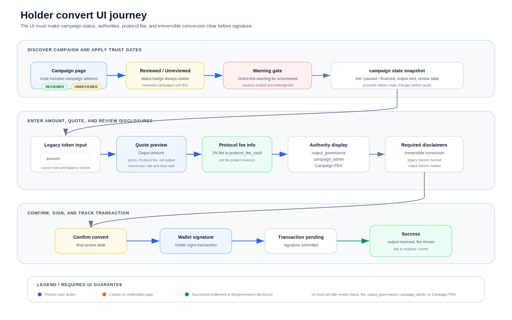

# REDAX UI Requirements

> Normative UI requirements for the canonical REDAX frontend (redaxhub.com) and
> any third-party frontend that wishes to claim REDAX-compatible status.

## Scope

Three flows specified:

- **Discovery Layer** (Phase 1 review-curated, Phase 2 Verified Tier-driven)
- **Create Campaign UI** (used by campaign creators)
- **Holder Convert UI** (used by holders before signing `convert_exact_in`)

Compliance is a Verified Tier requirement (Phase 2). Non-compliant frontends MAY
still be used but cannot display the "Verified" badge.

## Phase Note

Phase 1 mainnet ships with only:

- `merger_type = SingleProjectMigration`
- `output_mint_mode = ProgramCreatedOutputMint`
- `metadata_strategy = MetaplexMetadataCPI`
- `freeze_authority = None`

Other values rejected at program level. UI MUST disable these options with a
"Phase 2" tooltip.

## Phase 1 Discovery Policy (canonical UI behavior)

Per SPEC §13.7, the canonical REDAX UI MUST adhere to discovery rules during
Phase 1.

### Default discovery feed

```
┌──────────────────────────────────────────────────────────┐
│ REDAX REVIEWED PILOT CAMPAIGNS                            │
│                                                          │
│ Browse the curated pilot campaigns reviewed by REDAX.    │
│ All campaigns shown here have undergone manual review.   │
│                                                          │
│ [Token A -> A v2]  [Token X -> X v3]  [Token Y -> Y v2]   │
│                                                          │
│ Don't see your campaign? It may be unreviewed.           │
│ Direct campaign address access available.                │
└──────────────────────────────────────────────────────────┘
```

### Direct-link unreviewed campaign banner

When a user navigates directly to a campaign address that has NOT been reviewed
by REDAX:

```
┌──────────────────────────────────────────────────────────┐
│ WARNING: THIS CAMPAIGN IS NOT REVIEWED BY REDAX          │
│                                                          │
│ This campaign exists on-chain but has not been reviewed  │
│ by the REDAX team. It is not surfaced in the default     │
│ discovery feed.                                          │
│                                                          │
│ Anyone can create a Campaign by paying 0.5 SOL.          │
│ REDAX cannot prevent this. You should verify the         │
│ campaign creator independently before converting any     │
│ tokens.                                                  │
│                                                          │
│ Proceed only if you fully understand the risks.          │
│                                                          │
│ [I understand - show campaign details]                   │
└──────────────────────────────────────────────────────────┘
```

This banner MUST appear before any campaign details render. The user MUST click
"I understand" before details are shown.

### Search/listing review-status indicator

Any UI surface listing multiple campaigns MUST display review-status badges:

```
Reviewed   Token A -> A v2   (Single Migration)   Live
Reviewed   Token K -> L      (Single Migration)   Live
Unreviewed Token X -> ?      (Single Migration)   Live
Unreviewed Token M -> ?      (Single Migration)   Ended
```

The default sort places Reviewed campaigns above Unreviewed. A filter MUST be
available: "Show reviewed only" / "Show all (including unreviewed)".

### Phase 2 transition

When Verified Tier governance is active in Phase 2:

- "REDAX Reviewed" pilot label is replaced by "Verified" (Verified Tier criteria
  met)
- Campaigns that fail Verified Tier display "Unverified"
- Discovery Policy banner remains for direct-link unverified campaigns

---

## Create Campaign UI - Required Fields (in order)

### Step 1: Campaign Type Selection

| Option                        | Field value       | Phase 1 status                                                              |
| ----------------------------- | ----------------- | --------------------------------------------------------------------------- |
| Single Project Migration      | `merger_type = 0` | **Enabled** (only option)                                                   |
| Official Multi-Project Merger | `merger_type = 1` | **Disabled** - tooltip: "Available in Phase 2 (Q1-Q2 2027)"                 |
| Unofficial Migration Offer    | `merger_type = 2` | **Disabled** - tooltip: "Available in Phase 2 with disclosure requirements" |
| Community-led Migration       | `merger_type = 3` | **Disabled** - tooltip: "Available in Phase 2 with community evidence"      |

Phase 2 will activate the disabled options. Phase 1 UI MUST visibly mark them as
disabled, not hidden.

### Step 2: Output Token Setup

| Field                        | Required                    | Phase 1 source / value                        |
| ---------------------------- | --------------------------- | --------------------------------------------- |
| Output mint mode             | Yes                         | Locked: ProgramCreatedOutputMint              |
| Token name (string <= 32)    | Yes                         | Creator input - used in Metaplex metadata     |
| Token symbol (string <= 10)  | Yes                         | Creator input - used in Metaplex metadata     |
| Metadata URI (string <= 200) | Yes                         | Creator input - off-chain JSON pointer        |
| Decimals                     | Locked at 9                 | SPEC v1                                       |
| Output mint address          | Auto-generated              | Program-derived; preview shown before signing |
| Output token program         | Locked: SPL Token (Phase 1) | Phase 2: Token-2022 option                    |
| Freeze authority             | **Locked: None**            | Phase 2 evaluation                            |

UI MUST display educational text:

- "REDAX creates a new SPL Token Mint atomically with your campaign. Mint
  authority is held by the Campaign PDA - no human key can mint."
- "Token name, symbol, and image come from the Metaplex metadata account, which
  REDAX creates in the same transaction. The update authority is your
  output_governance address - you can change name/symbol later."
- "Freeze authority is set to None in Phase 1. Holders' tokens cannot be frozen
  by anyone."
- "The metadata URI should point to an off-chain JSON file (e.g., on Arweave or
  IPFS) following the Metaplex metadata standard. You'll find templates and
  tools at [Metaplex docs link]."

UI MUST validate:

- Name length <= 32 bytes
- Symbol length <= 10 bytes
- URI length <= 200 bytes
- URI is a well-formed URL (program does NOT validate content; UI does basic
  format check)

### Step 3: Output Governance

| Field                        | Required | Source        |
| ---------------------------- | -------- | ------------- |
| `output_governance` (Pubkey) | Yes      | Creator input |

UI MUST display:

- Helper text: "This address economically owns the output token. Use a multisig
  (Squads, SPL Multisig, or DAO governance program). REDAX is never the owner of
  your output token."
- Helper text: "The output_governance address also receives `update_authority`
  for the Metaplex metadata account, allowing future name/symbol/URI updates."
- Inline link: "Need a multisig? [Create one on Squads (external)]"

UI MUST validate:

- Address is non-zero
- Address is not equal to REDAX protocol multisig (also rejected at program
  level via R-OG-1)

### Step 4: Campaign Admin (operational)

| Field                     | Required | Default                             |
| ------------------------- | -------- | ----------------------------------- |
| `campaign_admin` (Pubkey) | Yes      | Pre-filled with `output_governance` |

UI MUST display: "This address can pause, finalize, and update operational
parameters. It cannot withdraw the protocol fee vault, change governance, or
change metadata."

### Step 5: Legacy Tokens

For each legacy mint:

- Mint address (Pubkey)
- Conversion rate (`rate_num`, `rate_den`)
- Per-token cap (`cap_in`)

For Phase 2 `OfficialMultiProjectMerger`: Each added legacy mint MUST display
attestation status (see Step 6).

### Step 6: Attestations (Phase 2 only)

UI displays a table of attestations with `attestation_authority_source`
indicator. Verified Tier review status shown for off-chain sources (3, 4, 5).

### Step 7: Authority Policy

| Option                 | `authority_policy` | Verified Tier eligible | Recommendation                            |
| ---------------------- | ------------------ | ---------------------- | ----------------------------------------- |
| Revoke                 | 0                  | Yes                    | **Default. Recommended.**                 |
| Bound to Campaign      | 1                  | Yes                    | Acceptable for advanced use               |
| Transfer to Governance | 2                  | No                     | High-risk; requires extra UI confirmation |

For option 2:

- UI MUST display warning: "WARNING: This option disqualifies your campaign from
  Verified Tier eligibility. The mint authority will transfer to your
  output_governance after finalization, allowing future mints. Holders should
  understand this risk."
- UI MUST require a separate acknowledgment checkbox.

### Step 8: Treasury Policy (applies to `protocol_fee_vault`)

UI MUST clarify: "This policy applies to the REDAX protocol fee vault (1% of
output tokens collected as REDAX fee). It does NOT apply to your project's own
treasury, which is managed by your output_governance off-protocol."

Options: Hold Forever / Vest & Controlled Execution (default) / Liquidity
Injection / Mixed.

### Step 9: Disclosure (Phase 2 - Unofficial / Community-led)

For Phase 2, UI displays disclaimer template (see SPEC §13.8 R-OG-7). Hash
stored as `disclaimer_hash`.

### Step 10: Review & Pay

UI MUST display final review:

- All entered parameters
- Four explicitly displayed addresses: `campaign_admin`, `output_governance`,
  `protocol_fee_vault` (auto-derived), `output_mint` (auto-derived)
- Metaplex metadata account preview (auto-derived)
- 0.5 SOL creation fee
- "Create Campaign" button - DISABLED if any required field missing or any
  validation fails

---

## Holder Convert UI - Required Display



Before any holder signs `convert_exact_in`, the UI MUST display a
non-dismissible information block:

### Required block - All campaign types

```
CAMPAIGN INFO
-------------
Type:                 [merger_type label]
Mode:                 Program-created mint (freeze authority: None)
From:                 [legacy_mint(s) and amounts]
To:                   [output_mint, name, symbol, expected amount]
Conversion rate:      Locked at creation (immutable)

Output governance:    [output_governance address]
                      [link to Solana Explorer for multisig members if applicable]
Campaign admin:       [campaign_admin address]
Protocol fee vault:   [auto-derived PDA - for transparency]
Authority policy:     [Revoked / BoundToCampaign / TransferToGovernance]

Review status:        [Reviewed / Unreviewed]
Verified tier:        [None / Verified by REDAX]  (Phase 2)
Treasury policy:      [Hold Forever / Vest / LP / Mixed] (applies to REDAX 1% fee)
Output liquidity:     [None / Declared / Verified]

Output token metadata: [Name] ([Symbol])
                       Image: [thumbnail from URI]
                       Metadata source: Metaplex Token Metadata

WARNING: This conversion is irreversible.
By signing, your legacy tokens are burned and output tokens are minted.
```

### Additional banners (in priority order)

1. **Phase 2 Unofficial Migration Offer** - RED banner with full disclaimer text
2. **Phase 2 Community-led Migration** - ORANGE banner with multisig + evidence
3. **TransferToGovernance authority policy** - YELLOW banner explaining
   post-campaign mint authority transfer
4. **Unreviewed campaign (Phase 1)** - Already shown by Discovery Policy banner
   before user reaches this step

UI MUST display the highest-severity applicable banner ABOVE the campaign info
block.

For Phase 2 `OfficialMultiProjectMerger`, attestation block appears within
campaign info.

---

## Campaign List View - Display Requirements

```
[Review status] [Verified status (P2)] [Campaign type] [Token transition] [Risk]

Phase 1 examples:
Reviewed    Single Migration      Token A -> A v2          (low risk)
Unreviewed  Single Migration      Token X -> X v3          (caution)

Phase 2 additions:
Verified    Official Merger       A + B -> C [OK OK]       (low risk)
Unofficial  Unofficial Offer      Token Y -> Z             (high risk)
Community   Community-led         Token K -> L             (medium risk)
```

UI sorting (Phase 1):

1. Reviewed campaigns first
2. Then Unreviewed (if filter allows)

UI sorting (Phase 2):

1. Verified campaigns first
2. Then non-verified (with appropriate banners)

---

## Prohibited UI Behaviors (MUST NOT)

A REDAX-compatible UI MUST NOT:

- Display "REDAX Reviewed" badge for any campaign that has not undergone REDAX
  manual review (Phase 1)
- Display "Verified" badge for any campaign with `verified_tier != Verified`
  (Phase 2)
- Display Verified badge for any campaign with
  `authority_policy == TransferToGovernance` (R-OG-11)
- Surface unreviewed campaigns in default discovery feed during Phase 1
  (R-OG-12)
- Skip the unreviewed-campaign warning banner on direct-link access (R-OG-12)
- Hide, minimize, or collapse warning banners
- Place disclaimer text in a footer, tooltip, or expandable section
- Display the convert button as enabled if attestation requirements are unmet
  (Phase 2)
- Use visual styling that creates ambiguity between Reviewed and Unreviewed
  campaigns
- Allow holders to skip the campaign info block before signing
- Conflate `protocol_fee_vault` with `project_treasury` in any display
- Display the output mint as having a non-None freeze authority in Phase 1
  (because it cannot - program enforces None)
